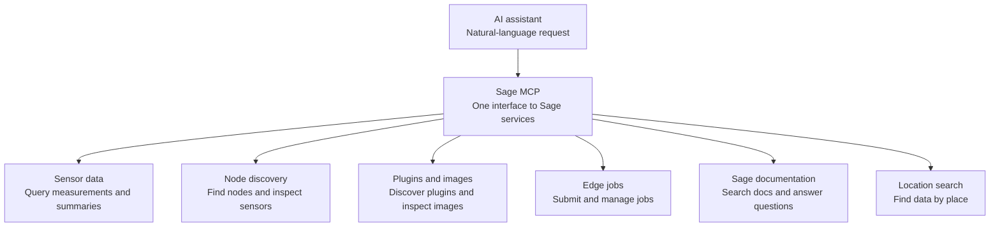
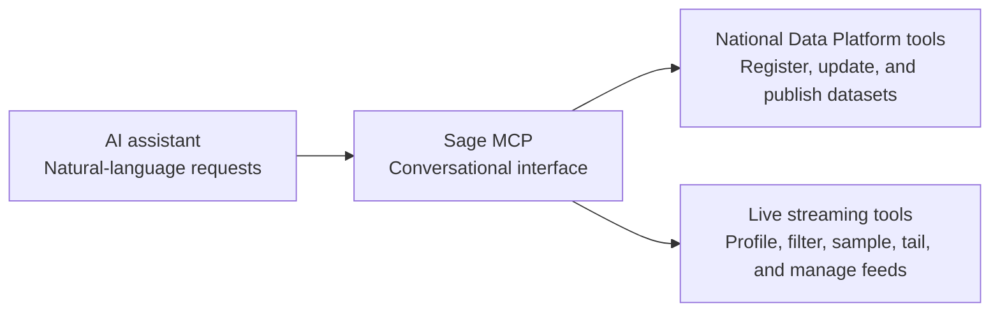
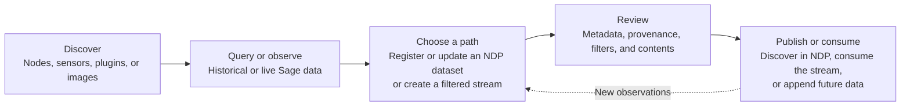

# Sage-NDP-SciDx MCP: Project Overview

## Sage MCP: Existing Capabilities

The Sage Model Context Protocol (MCP) server gives AI assistants a natural-language interface to the Sage edge-computing infrastructure. It can discover nodes and sensors, query measurements, inspect plugins and images, manage edge jobs, search documentation, and locate data by place. It supports public and authenticated access through several connection methods.

## Key Limitations

The existing Sage MCP helps users find and query data, but the work often continues outside Sage. Researchers still need to organize results, record where they came from, publish them for discovery, and work with live data without processing the entire Sage feed. Doing this manually across separate systems takes time, makes workflows difficult to repeat, and increases the risk of incomplete provenance or inconsistent metadata.

## Our Solution: NDP and Live Streaming Tools

This project proposes new tools that extend the Sage MCP workflow to include National Data Platform's (NDP) and Scientific Data Exchange's (SciDx) capabilities for dataset registration, publication, and live streaming. The new tools allow users to seamlessly integrate Sage data with the NDP and SciDx ecosystems. Users can now:

- Register on NDP,  Sage results and other resources as datasets.
- Record their source, query, time range, nodes, and plugins.
- Review metadata before registration or publication.
- Add resources as new data becomes available.
- Publish to the appropriate NDP catalog.
- Create and validate filtered streams from the live Sage feed.

These changes reduce manual handoffs and create a clearer, repeatable path from observation to reusable research data.

## National Data Platform tools

These tools support catalog discovery, dataset registration, updates, and publication:

- **ndp_list_organizations** lists organizations that can own datasets.
- **ndp_search_datasets** searches the catalog by keyword.
- **ndp_create_organization** creates an organization if it does not already exist.
- **ndp_register_url** registers data available at a stable web address.
- **ndp_register_local_path** prepares a local file or folder for registration.
- **ndp_register_from_sage** queries Sage and prepares a dataset with automatically captured provenance.
- **ndp_append_from_sage** adds only new Sage resources to an existing dataset.
- **ndp_add_resource** adds one web resource without replacing existing resources.
- **ndp_finalize_registration** applies metadata changes and completes a reviewed registration.
- **ndp_publish_dataset** publishes a dataset to a selected local or public catalog.

Registration is intentionally reviewable. Dataset preparation first produces a preview. Users can correct the title, description, owner, tags, and unresolved questions before confirming the write. Public publication requires a separate confirmation. Duplicate checks help prevent repeated organizations, datasets, or resources.

## Live streaming tools

These tools turn the full Sage event feed into smaller, purpose-specific streams. Each derived stream uses a private Kafka topic and is registered in NDP with its source and filters.

- **stream_ensure_sage_source** registers the main Sage live feed in NDP when needed.
- **stream_profile_sage** samples the feed and reports fields and observed values.
- **stream_create_derived** creates, registers, and starts a filtered stream.
- **stream_list** lists owned streams and shows whether their producers are active.
- **stream_sample** returns a short snapshot for validation.
- **stream_tail** shows newly arrived records and supports an additional viewing filter.
- **stream_delete** stops a stream and, after confirmation, removes its NDP resource and Kafka topic.

Profiling exposes real node identifiers, measurement names, and values before filters are created. Sampling and tailing then confirm that the derived stream contains the intended records.

## Benefits and Improvements

The expanded workflow is:

1. Discover and query relevant Sage data.
2. Register the result, update an existing NDP dataset, or create a filtered stream.
3. Review metadata, provenance, filters, and contents.
4. Validate through catalog search, stream sampling, or live tailing.
5. Publish the dataset or consume the stream.
6. Add new resources as observations continue.

The additions make Sage data more reusable, traceable, and easier to share. Provenance is captured during the query instead of reconstructed later. Preview and confirmation gates make publication safer. Filters make the live feed manageable, while duplicate checks and additive updates support repeated workflows.

The extensions are additive: if NDP or streaming services are unavailable, the core Sage MCP can continue operating.

## Scope for Future Development

Future work can make the system more durable, scalable, and secure:

- Run derived streams as durable services that survive MCP restarts.
- Add stream monitoring, restart support, retention settings, and health reporting.
- Strengthen authenticated access, ownership checks, and destructive-operation controls.
- Persist staged registrations and support longer approval workflows.
- Add scheduled Sage-to-NDP refreshes and clearer dataset-to-stream lifecycle views.
- Support larger collections through managed uploads, batching, bundles, resumable transfers, and configurable limits.
- Improve metadata validation, keywords, licenses, data-quality notes, provenance, and end-to-end testing across Sage, NDP, and Kafka.

The long-term goal is one conversational entry point for discovering Sage data, processing it in real time, preserving its context, and publishing it responsibly.
