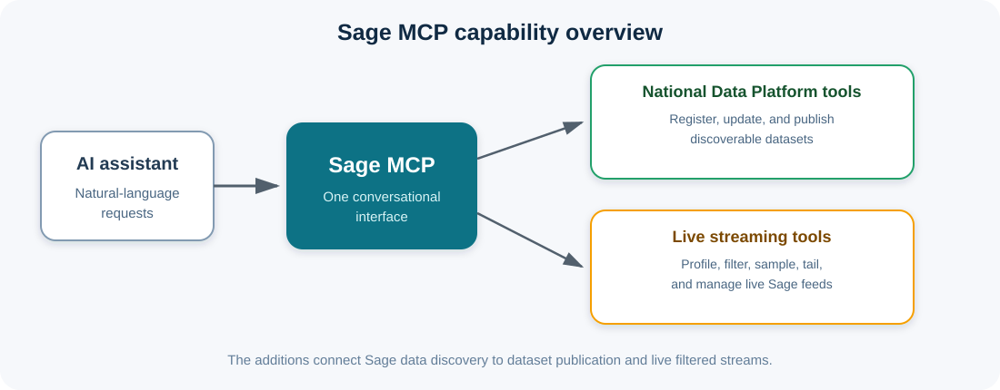
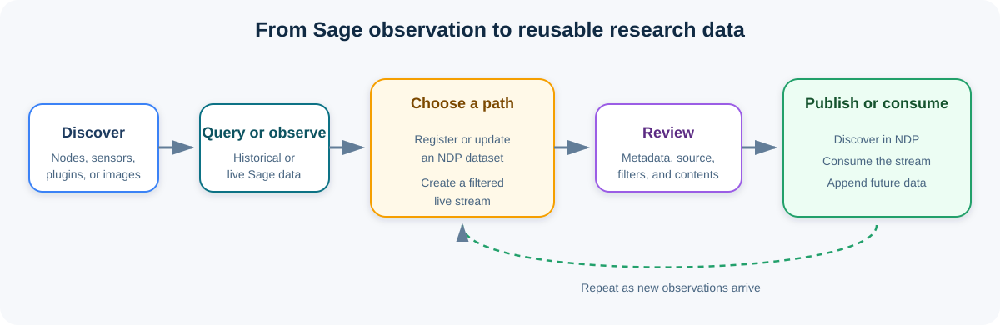

# Sage MCP: Project Overview

## The existing Sage MCP

The Sage Model Context Protocol server connects AI assistants and other compatible clients to the Sage cyberinfrastructure for artificial intelligence at the edge. It turns common Sage activities into tools that can be used through natural-language requests.

The existing server already provides a broad set of capabilities. A user can discover Sage nodes and sensors, query current and historical measurements, summarize environmental data, find and inspect plugins, view images, submit and manage edge-computing jobs, search Sage documentation, and locate nodes or measurements by place. It also supports public and authenticated data access, several connection methods, and usage monitoring for hosted deployments.

This makes the original Sage MCP a useful interface for exploring and operating Sage. However, its main focus is interaction with Sage itself. A result can be found and analyzed, but additional work is needed to preserve it as a reusable dataset, publish it for discovery, or turn a live Sage feed into a manageable data stream.

## Why we added new tools

Research data is most useful when it can move through a complete lifecycle. Users need to discover data, inspect it, save it, describe where it came from, share it, and continue working with it as new observations arrive.

The new tools were added to close the gap between Sage data access and the National Data Platform. They allow an assistant to help with the work that normally follows a Sage query:

- Register a Sage result or another data resource as a dataset.
- Preserve the query details and source information needed to understand its origin.
- Review dataset information before anything is written or published.
- Add new resources to an existing dataset as more data becomes available.
- Publish a dataset deliberately to the appropriate catalog.
- Create a filtered live stream from the full Sage feed.
- Inspect and validate live data before and after creating a stream.

These additions reduce manual handoffs between systems and make the path from observation to reusable research asset easier to follow and repeat.

## Tools added to the project

### National Data Platform tools

The National Data Platform tools connect Sage results and other resources to an NDP catalog.

- **ndp_list_organizations** lists the organizations that can own datasets.
- **ndp_search_datasets** searches the catalog by keyword.
- **ndp_create_organization** creates a dataset-owning organization when it does not already exist.
- **ndp_register_url** creates a dataset that refers to data already available at a stable web address.
- **ndp_register_local_path** prepares a local file or folder for registration.
- **ndp_register_from_sage** queries Sage and prepares the result as a dataset while automatically recording its source, filters, time window, nodes, and plugins.
- **ndp_append_from_sage** finds new Sage resources and adds only those that are not already attached to an existing dataset.
- **ndp_add_resource** adds one web resource to an existing dataset without replacing its current resources.
- **ndp_finalize_registration** applies requested metadata changes and completes a previously reviewed registration.
- **ndp_publish_dataset** sends a registered dataset to the chosen local or public catalog.

Registration is designed as a reviewable process. Preparing a dataset normally produces a preview first. The user can correct the title, description, ownership, tags, or answers to unresolved questions before confirming the write. Public publication is a separate confirmed action. Existing organizations, datasets, and resource addresses are checked where appropriate so repeated requests do not create unnecessary duplicates.

### Live streaming tools

The streaming tools turn the full live Sage event feed into smaller, purpose-specific streams. A filtered stream is delivered through a private Kafka topic and registered in NDP with information about its source and filters.

- **stream_ensure_sage_source** makes sure the main Sage live feed is represented in the NDP catalog.
- **stream_profile_sage** briefly samples the feed and reports the fields and values that are actually present.
- **stream_create_derived** creates a filtered stream, registers it, and starts forwarding matching Sage records.
- **stream_list** shows the derived streams owned by the user and whether their local producers are active.
- **stream_sample** reads a short snapshot from a derived stream to verify its contents.
- **stream_tail** shows new records that have arrived since the previous request and can apply an additional viewing filter.
- **stream_delete** stops a derived stream and, after confirmation, removes its catalog resource and Kafka topic.

Profiling is an important part of this workflow. It lets an assistant use real node identifiers, measurement names, and observed values instead of guessing. Sampling and tailing then provide practical ways to confirm that a new stream is receiving the intended records.

## How the additions improve the MCP

The expanded MCP is no longer limited to answering questions about Sage. It can support a connected workflow from initial discovery to longer-term use:

1. Find relevant Sage nodes, measurements, images, or plugins.
2. Query or observe the data.
3. Register the result as an NDP dataset, add it to an existing dataset, or create a filtered live stream.
4. Review the metadata and provenance.
5. Validate the result through catalog search, stream sampling, or live tailing.
6. Publish the dataset to the appropriate NDP catalog or consume the derived stream.
7. Add new resources later without rebuilding the dataset.

This improves the project in several ways. Provenance is captured at the time of the query rather than reconstructed later. Dataset publication becomes safer because previews and confirmations separate preparation, registration, and public release. Live data becomes easier to work with because users can reduce the full Sage feed to the nodes and measurements they need. Duplicate checks and additive updates make repeated workflows more reliable. Finally, all of these actions are available through the same conversational interface as the original Sage tools.

The extensions are also additive. If an optional NDP or streaming dependency is unavailable, the core Sage MCP can continue to operate. This preserves the value and stability of the original server while allowing richer workflows in environments that have the additional services configured.

## Future scope

The next stage of the project can focus on making these workflows more durable, scalable, and accessible.

- Move stream producers from the current server session into a durable managed service so a derived stream continues running after the MCP server restarts.
- Add monitoring, health information, restart support, and retention controls for long-running streams.
- Improve protected-data handling so authenticated Sage access is consistently available throughout queries, registration, and streaming.
- Add managed upload support for local files instead of relying on local file references.
- Support larger collections through batching, bundles, resumable transfers, and configurable resource limits.
- Persist staged dataset registrations so reviews can survive a restart and support longer approval workflows.
- Expand metadata assistance with stronger validation, recommended keywords, licenses, data-quality notes, and richer provenance links.
- Add scheduled dataset refreshes so catalog entries can be updated automatically from recurring Sage queries.
- Provide clearer lifecycle views that connect a Sage query, its NDP dataset, and any derived streams.
- Add more end-to-end tests against development deployments of Sage, NDP, and Kafka while keeping offline tests for routine development.
- Improve access controls and ownership checks for shared deployments, especially for destructive stream operations and public publication.

Together, these improvements would move the project toward a durable research data service: one conversational entry point for discovering Sage data, processing it in real time, preserving its context, and sharing it responsibly.
